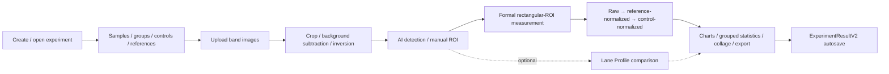
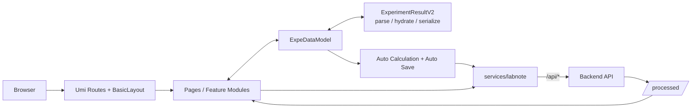

<h1 align="center">BandQuant · 条带宝</h1>

<p align="center">
  A Western Blot workspace for image processing, quantitative analysis, and experiment data management
</p>

<p align="center">
  
  
  
  
  
  
</p>

<p align="center">
  <a href="./README.md">简体中文</a>
  ·
  <a href="#-core-capabilities">Capabilities</a>
  ·
  <a href="#-experiment-workflow">Workflow</a>
  ·
  <a href="#-quick-start">Quick Start</a>
  ·
  <a href="#-architecture-overview">Architecture</a>
  ·
  <a href="#-build--deployment">Deployment</a>
</p>

---

## ✨ Overview

**BandQuant** is a web client for Western Blot and similar band-based experiments. The current product is organized around this end-to-end workflow:

> **Experiment design → image processing → ROI quantification → derived calculations → method comparison → chart / collage export → experiment persistence**

It provides both a full authenticated experiment workspace and a fast no-login guest workflow.

> [!IMPORTANT] This repository contains the **frontend application**. Business APIs, image-processing services, and files served under `/processed/` are provided by the companion backend.

## 🚀 Core capabilities

| 🤖 AI band detection | 📏 Formal ROI quantification | 📈 Lane-profile comparison |
| --- | --- | --- |
| Uses `/api/v2/strip-detections` to detect band ROIs, with add/delete/reposition controls before measurement. | Rectangular ROIs are sent to `/api/measure-rectangles` and persist IntDen, Area, Mean, Min, Max, and related formal measurements. | A separate lane-profile v2 method for peak area, polarity, and ROI-vs-lane comparison. It does not replace formal ROI results. |

| 🧪 Experiment workspace | 💾 Calculation & autosave | 🌍 Bilingual + guest mode |
| --- | --- | --- |
| Samples, original band images, calculation tables, and result views live in one experiment workspace. | Raw, reference-normalized, and control-normalized values are maintained with debounced, serialized autosave. | `zh-CN` / `en-US` support plus a no-login workflow for quick analysis and export. |

### Also included

- Samples, sample groups, control sets, reference assignments, and experiment-purpose metadata
- Cropping, background subtraction, inversion, processing history, and undo
- AI detection, manual ROIs, ROI-count validation, and sample rematching
- Reference alignment, grouped statistics, chart configuration, and band collage
- PNG, CSV, and XLSX export paths
- Email-verification registration, JWT authentication, and email-based password reset
- Experiment V2 schema parsing, compatibility handling, hydrate, and serialize boundaries

## 🧭 Experiment workflow



### Keeping ROIs aligned with samples

1. After AI detection, the selected-box count and total sample count remain visible.
2. Missing boxes can be added; extra boxes can be selected and deleted.
3. Starting a new manual-drawing pass warns that existing results will be cleared.
4. Formal measurement is blocked until the ROI count exactly matches the sample count.
5. Immediately before measurement, ROIs are sorted by actual horizontal position and rematched to the left-to-right sample order.
6. Changes to the ROI geometry, source image, or sample relationship invalidate measurements and lane-derived state that depended on the previous geometry.

## ⚖️ Two quantification methods, two roles

|  | Rectangular ROI | Lane Profile |
| --- | --- | --- |
| Role | **Formal quantification** | **Method comparison** |
| Source | `/api/measure-rectangles` | Frontend lane-profile v2 analysis |
| Main metrics | IntDen, Area, Mean, Min, Max | Peak Area, Peak Bounds, Polarity |
| Writes formal result | ✅ Yes | ❌ Never silently replaces ROI results |
| Adjustment tools | Move / add / delete ROI | Move lane, uniform width, peak bounds, polarity confirmation |

Lane-profile v2 persists sample order, common lane width, peak bounds, peak area, band polarity, polarity confidence, and polarity source. The result view can reconstruct the profile curve and compare normalized ROI IntDen with normalized lane peak area.

## 🧱 Architecture overview



### Layer responsibilities

| Layer | Main location | Responsibility |
| --- | --- | --- |
| App shell / routing | `config/routes.ts`, `src/app.tsx`, `BasicLayout` | Auth entry points, layout, locale, global request behavior |
| Pages / feature modules | `src/pages/` | Experiments, results, guest mode, account flows |
| Experiment state | `src/models/ExpeDataModel.ts` | Core in-memory state while editing an experiment |
| Data contract | `src/utils/experimentSchema.ts` | V2 schema parsing, compatibility, serialization |
| Derived calculation / save | `useAutoCalculation`, `useAutoSave` | Derived tables and serialized autosave |
| API service layer | `src/services/labnote/` | Experiment, auth, image processing, strip-detection APIs |
| Algorithms / pure utilities | `src/utils/` | Lane Profile, Strip Detection contracts, Chart Config, export helpers |

## ⚡ Quick Start

### 1. Install dependencies

```bash
npm install
```

### 2. Configure the backend target

Create a root-level `.env.dev` file:

```dotenv
PROXY_TARGET=http://127.0.0.1:3300
```

Or set it temporarily in PowerShell:

```powershell
$env:PROXY_TARGET = 'http://127.0.0.1:3300'
npm run dev
```

During development, `config/proxy.ts` forwards both:

```text
/api/*
/processed/*
```

### 3. Start the frontend

```bash
npm run dev
```

Other supported entry points include:

```bash
npm start
npm run start:no-mock
```

## 🧰 Technology stack

<p>
  
  
  
  
  
  
  
</p>

| Category              | Main technologies                               |
| --------------------- | ----------------------------------------------- |
| UI                    | React 18.2, Ant Design 5.26, Pro Components 2.8 |
| Application framework | Umi Max 4.7                                     |
| Types                 | TypeScript 4.9                                  |
| Canvas                | Fabric.js 6.4                                   |
| Charts                | ECharts 5.6 / echarts-for-react                 |
| Requests              | Umi Request / Axios                             |
| Images                | tiff.js + backend image-processing APIs         |
| Drag/drop             | dnd-kit                                         |
| Export                | xlsx, html2canvas, PNG helpers                  |
| Testing               | Jest 29, Testing Library                        |

## 📁 Project structure

<details>
<summary><strong>Expand directory layout</strong></summary>

```text
Client_Codeup/
├─ config/
│  ├─ config.ts                # Umi / locale / request / build
│  ├─ routes.ts                # Routing
│  └─ proxy.ts                 # Development proxies
├─ public/
│  ├─ icons/                   # Logo / App Icons
│  └─ demo-pic/                # Guest-mode demo images
├─ src/
│  ├─ components/
│  │  └─ ImageEditor/          # Canvas / crop / measurement editors
│  ├─ hooks/
│  │  ├─ useAutoCalculation.ts
│  │  └─ useAutoSave.ts
│  ├─ layouts/BasicLayout.tsx
│  ├─ locales/                 # zh-CN / en-US
│  ├─ models/ExpeDataModel.ts  # Experiment editing state
│  ├─ pages/
│  │  ├─ newExperiment/        # Experiment workspace shell
│  │  ├─ NewExpeSample/        # Samples / groups / controls
│  │  ├─ NewExpeOriginalData/  # Images / ROIs / measurement / Lane Profile
│  │  ├─ NewExpeCalculateDataTable/
│  │  ├─ NewExpeResult/        # Charts / comparison / collage / statistics
│  │  ├─ GuestMode/
│  │  └─ user/                 # Login / registration / password reset
│  ├─ services/labnote/        # Backend API boundary
│  ├─ utils/                   # Schema / algorithms / export / pure utilities
│  └─ app.tsx                  # initialState / JWT / runtime layout
├─ types/expeDataInterface.ts
├─ tests/
├─ README.md
└─ README_en.md
```

</details>

## 🔐 Authentication & requests

<details>
<summary><strong>Email registration, JWT, and password reset</strong></summary>

The current registration UI exposes an **email-only** flow:

```text
Email → verification code → password / confirmation
```

The submitted payload uses the email as the account identifier and declares:

```text
registerType: email
```

After login, the JWT is stored in `localStorage.token`. The request interceptor in `src/app.tsx` adds:

```http
Authorization: Bearer <token>
```

The current signed-in user is initialized through:

```http
GET /api/currentUser
```

Password reset endpoints:

```http
POST /api/auth/password-reset/request
POST /api/auth/password-reset/confirm
```

A successful reset clears the local token and returns the user to the login page.

</details>

## 🗃️ Experiment data contract

<details>
<summary><strong>ExperimentResultV2 / schemaVersion 2</strong></summary>

Experiment persistence is centered on `ExperimentResultV2`:

```text
ExperimentResultV2
├─ schemaVersion: 2
├─ purpose
├─ samples
├─ parameters
├─ originalDatas
├─ sampleGroups
├─ controlSets
├─ referenceAssignments
├─ baseTableData
├─ normalizedTableData
├─ controlTableData
├─ result
├─ stripeConfig
└─ chartConfig
```

Load path:

```text
persisted result
    ↓
parseExperimentResult()
    ↓
hydrate
    ↓
ExpeDataModel
```

Save path:

```text
ExpeDataModel
    ↓
getSavePayload()
    ↓
serializeExperimentResult()
    ↓
ExperimentResultV2
```

`parseExperimentResult()` preserves compatibility with currently supported historical shapes and protects the client from unknown future schema versions.

Lane-profile comparison data is versioned separately. The active format is `lane-profile-v2`; persisted `lane-profile-v1` data is recognized for compatibility but the result UI asks the user to re-analyze it.

</details>

## 🔌 API boundary

<details>
<summary><strong>Common endpoints</strong></summary>

### Experiments and folders

```http
GET  /api/category_list
POST /api/create_experiment
POST /api/save_experiment
GET  /api/one_experiment/:experimentId
GET  /api/experiments/recent
```

The service layer also contains experiment/folder rename, move, and delete operations.

### Image processing and quantification

```http
POST /api/subtract-background
POST /api/invert-colors
POST /api/measure-rectangles
POST /api/v2/strip-detections
```

Processed images are served by the backend through `/processed/`.

</details>

## 🛣️ Routes

<details>
<summary><strong>Public and authenticated pages</strong></summary>

| Path                    | Page                            | Login required |
| ----------------------- | ------------------------------- | -------------- |
| `/user/login`           | Login                           | No             |
| `/user/register`        | Email-verification registration | No             |
| `/user/forgot-password` | Email-code password reset       | No             |
| `/guest`                | Guest quick analysis            | No             |
| `/main`                 | Main page                       | Yes            |
| `/recentlyEdited`       | Recently edited                 | Yes            |
| `/statistics`           | Statistics                      | Yes            |
| `/SingleExpe`           | Single-experiment entry         | Yes            |
| `/newExperiment`        | Experiment editing workspace    | Yes            |

`/` redirects to `/main`; unmatched paths use the global 404 route.

</details>

## 👤 Guest mode

`/guest` does not require an account, although some image-processing operations still call backend APIs. The current workflow supports:

- PNG / JPEG / TIFF-style image upload and bundled demo images
- Cropping, measurement, and background processing
- Reference-image and control-sample selection
- Raw / fold-change result views
- Color / grayscale chart themes
- Original-band-to-chart-position comparison
- PNG chart download and CSV export

Use the authenticated experiment workspace when durable persistence, folder organization, and cross-session experiment management are required.

## 🧪 Development & testing

| Command                 | Purpose                                            |
| ----------------------- | -------------------------------------------------- |
| `npm run dev`           | Development mode, Mock disabled, dev proxy enabled |
| `npm run build`         | Build production static assets                     |
| `npm run preview`       | Preview the build on port 8000                     |
| `npm test`              | Run Jest                                           |
| `npm run test:coverage` | Coverage                                           |
| `npm run lint`          | ESLint + Prettier                                  |
| `npm run lint:fix`      | Auto-fix lint issues                               |
| `npm run tsc`           | TypeScript `--noEmit`                              |
| `npm run analyze`       | Analyze the production bundle                      |

For ROI, experiment-schema, autosave, or Lane Profile changes, run the corresponding focused tests before broader related regression coverage.

## 🌐 Internationalization

Chinese is the configured default language. The application supports:

```text
?locale=zh-CN
?locale=en-US
```

The locale parameter is copied to `localStorage('umi_locale')` and then removed from the address bar.

Keep Chinese and English locale files in sync for new user-facing text.

## 📦 Build & deployment

```bash
npm run build
```

Production static assets are written to `dist/`.

> [!WARNING] The **Umi development proxy only exists in development**. In production, the Web server or gateway must route `/api/*` and `/processed/*` to the companion backend. Otherwise the static frontend can load while login, experiment persistence, and image processing fail.

The frontend uses `publicPath: '/'` and hashed asset filenames. SPA deployment must also provide history fallback to `index.html`.

## 🧭 Architecture invariants

When changing core flows, keep these constraints intact:

- Keep experiment persistence behind the `ExperimentResultV2` parse / serialize boundary.
- When adding experiment fields, define historical hydrate behavior, defaults, and future-schema protection at the same time.
- Changes to an ROI or its source image must invalidate measurements and Lane Profile output that depended on the old geometry.
- Lane Profile is comparison data and must not silently overwrite formal rectangular-ROI results.
- Before committing asynchronous image-processing or AI-detection responses, verify that the source / ROI / sample context is still current.
- Keep user-facing states and errors aligned across Chinese and English, with focused regression coverage for behavior changes.

---

<p align="center">
  Built with <a href="https://react.dev/">React</a> ·
  <a href="https://umijs.org/">UmiJS</a> ·
  <a href="https://ant.design/">Ant Design</a> ·
  <a href="https://fabricjs.com/">Fabric.js</a> ·
  <a href="https://echarts.apache.org/">Apache ECharts</a>
</p>
