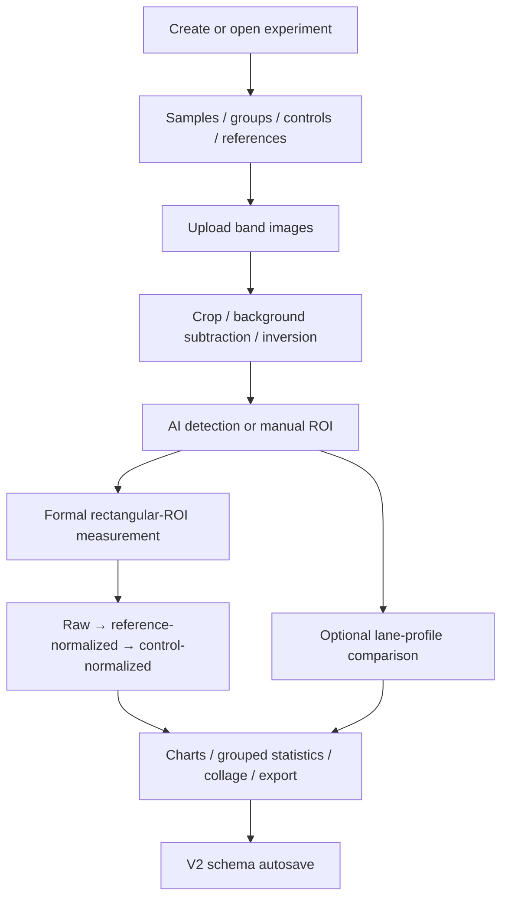

# BandQuant


BandQuant is a web client for managing and quantitatively analyzing Western Blot and similar band-based experiments. The current application is organized around the workflow **experiment design → image processing → ROI quantification → derived calculations → method comparison → chart/collage export → persistence**, with an email-based account system and a no-login guest workflow.

> This repository contains the frontend application. Business APIs, image-processing services, and processed-image files are provided by the companion backend. During development, the frontend reaches that backend through the `/api/` and `/processed/` proxies.

## Current capabilities

| Area | Current implementation |
| --- | --- | --- |
| Experiment workspace | Samples, original band images, calculation tables, and results are composed into one experiment workspace |
| Experiment design | Samples, sample groups, control sets, reference assignments, experiment purpose, and related structured metadata |
| Image processing | Cropping, background subtraction, inversion, processing history/undo, and ROI annotation |
| AI band detection | `/api/v2/strip-detections` detects ROIs and lets users add, delete, or reposition boxes before measurement |
| Formal quantification | Rectangular ROIs are sent to `/api/measure-rectangles` and persist IntDen, Area, Mean, Min, Max, and related values |
| Lane-profile comparison | A separate lane-profile v2 comparison method with polarity detection, peak-bound adjustment, peak area, and ROI-vs-lane comparison |
| Derived calculations | Raw signal, reference-normalized values, and control-normalized values are maintained as separate calculation layers |
| Result integration | Chart configuration, grouped statistics, reference alignment, band collage, and PNG/XLSX export capabilities |
| Autosave | Experiment edits are debounced and save requests are serialized so newer state cannot be overwritten by an older request |
| Accounts | Email verification registration, login, JWT authentication, and email-based password reset |
| Guest mode | Upload/crop/process bands without an account, select reference/control values, inspect raw/fold-change results, and export charts/CSV |
| Internationalization | `zh-CN` and `en-US`, with UI switching and `?locale=zh-CN | en-US` support |

## Architecture overview

```mermaid
flowchart LR
    Browser[Browser]
    Router[Umi Routes + BasicLayout]
    Pages[Pages / Feature Modules]
    Model[Umi Model: ExpeDataModel]
    Schema[ExperimentResultV2\nparse / hydrate / serialize]
    AutoSave[useAutoSave]
    Services[services/labnote]
    Backend[Backend API]
    Processed[/processed/ files]

    Browser --> Router --> Pages
    Pages <--> Model
    Model <--> Schema
    Model --> AutoSave --> Services
    Pages --> Services
    Services -->|/api/*| Backend
    Backend --> Processed
    Processed --> Pages
```

### Layer responsibilities

- **Routing and application shell**: `config/routes.ts`, `src/layouts/BasicLayout.tsx`, and `src/app.tsx` define public/authenticated entry points, the main layout, language handling, and global request behavior.
- **Pages and feature modules**: `src/pages/` contains experiment management, guest mode, account flows, and result views.
- **Experiment editing state**: `src/models/ExpeDataModel.ts` is the primary in-memory state container while an experiment is being edited.
- **Persistence contract**: `src/utils/experimentSchema.ts` owns experiment parsing, compatibility normalization, and serialization.
- **Derived calculation and autosave**: `useAutoCalculation` derives tables while `useAutoSave` handles debounce and serialized persistence.
- **API service layer**: `src/services/labnote/` separates authentication, experiment management, image processing, and strip detection from UI components.
- **Algorithms and pure utilities**: `src/utils/` contains testable logic for experiment schemas, strip-detection contracts, lane profiles, chart configuration, image signatures, and export helpers.

## Experiment data model

Persistence is centered on `ExperimentResultV2`, with `schemaVersion` fixed at `2` for newly serialized experiment data.

```text
ExperimentResultV2
├─ schemaVersion: 2
├─ purpose
├─ samples
├─ parameters
├─ originalDatas
├─ sampleGroups
├─ controlSets
├─ referenceAssignments
├─ baseTableData
├─ normalizedTableData
├─ controlTableData
├─ result
├─ stripeConfig
├─ chartConfig
└─ lastUpdate / compatibility fields
```

When an experiment is loaded, `parseExperimentResult()` normalizes the persisted payload before it is hydrated into `ExpeDataModel`. Saving goes through `serializeExperimentResult()` / `getSavePayload()` so page components do not build independent database JSON shapes.

`parseExperimentResult()` keeps compatibility with supported historical data while protecting the client from unknown future schema versions. Lane-profile comparison data is versioned separately: the active implementation is `lane-profile-v2`; persisted `lane-profile-v1` data can be recognized for compatibility, but the result UI asks the user to re-analyze it before using the current comparison workflow.

## Experiment workflow



### ROI-to-sample matching

Rectangular ROIs are the source of formal quantification. The current interaction model enforces these rules:

1. After AI detection, the selected-box count and total sample count remain visible even when they match.
2. When there are fewer boxes than samples, the user can add a box; when there are too many, the user selects an existing box and deletes it.
3. Switching to a new manual-drawing pass warns that existing results will be cleared and treats the newly drawn boxes as the new baseline.
4. Formal measurement is blocked until the ROI count equals the sample count.
5. Immediately before formal measurement, ROIs are sorted by their actual horizontal positions and re-matched to the left-to-right sample order.
6. Changes to the ROI geometry, source image, or sample relationship invalidate measurements and lane-derived state that depended on the old geometry.

### Rectangular ROI and lane profile are different methods

- **Rectangular ROI** calls `/api/measure-rectangles` and is the source of the experiment's formal measurement values.
- **Lane profile** is an optional method-comparison workflow; it does not silently replace formal rectangular-ROI results.
- Lane-profile v2 persists sample order, a common lane width, peak bounds, peak area, band polarity, polarity confidence, and whether polarity was selected automatically or manually.
- Lane overlays can be moved, their width can be resized uniformly, and peak integration bounds can be adjusted manually. Low-confidence polarity requires user confirmation.
- The result view can reconstruct the profile and compare normalized ROI IntDen values with normalized lane peak areas.

## Routes

| Path                    | Purpose                                     | Login required |
| ----------------------- | ------------------------------------------- | -------------- |
| `/user/login`           | Login                                       | No             |
| `/user/register`        | Email-verification registration             | No             |
| `/user/forgot-password` | Email-code password reset                   | No             |
| `/guest`                | Guest quick analysis                        | No             |
| `/main`                 | Main page and experiment/folder entry point | Yes            |
| `/recentlyEdited`       | Recently edited experiments                 | Yes            |
| `/statistics`           | Statistics page                             | Yes            |
| `/SingleExpe`           | Single-experiment entry                     | Yes            |
| `/newExperiment`        | Experiment editing workspace                | Yes            |

`/` redirects to `/main`; unmatched paths use the global 404 route.

## Authentication and request flow

The registration UI currently exposes an **email-only** registration flow: email → verification code → password/confirmation. The submitted payload uses the email as the account identifier and declares `registerType: 'email'`.

After login, the JWT is stored in `localStorage.token`. The request interceptor in `src/app.tsx` automatically sends:

```http
Authorization: Bearer <token>
```

The application initializes the signed-in user through `GET /api/currentUser`. Password reset uses dedicated endpoints:

- `POST /api/auth/password-reset/request`
- `POST /api/auth/password-reset/confirm`

A successful password reset clears the local token and returns the user to the login page.

## API boundary

Frontend API wrappers are concentrated in `src/services/labnote/`.

### Experiments and folders

- `GET /api/category_list`
- `POST /api/create_experiment`
- `POST /api/save_experiment`
- `GET /api/one_experiment/:experimentId`
- `GET /api/experiments/recent`
- Experiment/folder rename, move, and delete endpoints

### Image processing and quantification

- `POST /api/subtract-background`
- `POST /api/invert-colors`
- `POST /api/measure-rectangles`
- `POST /api/v2/strip-detections`

Processed files generated by the backend are exposed to the frontend under `/processed/`.

## Guest mode

`/guest` does not require an account, but some image-processing operations still call backend APIs. The current guest workflow supports:

- Uploading PNG/JPEG/TIFF-style images or loading bundled demo images;
- Cropping and measurement;
- Background processing;
- Selecting a reference image and control sample;
- Raw and fold-change result views;
- Color and grayscale chart themes;
- Showing original band images next to chart positions;
- PNG chart download and CSV data export.

Guest mode is intended for quick analysis. Durable experiment persistence, folder organization, and cross-session experiment management belong to the authenticated experiment workspace.

## Technology stack

| Category              | Main technologies                               |
| --------------------- | ----------------------------------------------- |
| UI                    | React 18.2, Ant Design 5.26, Pro Components 2.8 |
| Application framework | Umi Max 4.7                                     |
| Types                 | TypeScript 4.9                                  |
| Canvas                | Fabric.js 6.4                                   |
| Charts                | ECharts 5.6 / echarts-for-react                 |
| Requests              | Umi Request / Axios                             |
| Export                | xlsx, html2canvas, PNG helpers                  |
| Images                | tiff.js plus backend image-processing APIs      |
| Drag/drop             | dnd-kit                                         |
| Testing               | Jest 29, Testing Library                        |
| Code quality          | ESLint, Prettier, Husky                         |

## Project structure

```text
Client_Codeup/
├─ config/
│  ├─ config.ts             # Umi config, locale, request, build
│  ├─ routes.ts             # Routing
│  └─ proxy.ts              # Development proxies
├─ public/                  # Static assets and demo images
├─ src/
│  ├─ components/
│  │  └─ ImageEditor/       # Reusable canvas/cropping/measurement editors
│  ├─ hooks/
│  │  ├─ useAutoCalculation.ts
│  │  └─ useAutoSave.ts
│  ├─ layouts/BasicLayout.tsx
│  ├─ locales/              # zh-CN / en-US
│  ├─ models/
│  │  └─ ExpeDataModel.ts   # Experiment editing state
│  ├─ pages/
│  │  ├─ newExperiment/     # Experiment workspace shell
│  │  ├─ NewExpeSample/     # Samples, groups, controls
│  │  ├─ NewExpeOriginalData/ # Images, ROIs, measurement, lane profile
│  │  ├─ NewExpeCalculateDataTable/
│  │  ├─ NewExpeResult/     # Charts, method comparison, collage, statistics
│  │  ├─ GuestMode/
│  │  └─ user/              # Login/registration/password reset
│  ├─ services/labnote/     # Backend API boundary
│  ├─ utils/                # Schemas, algorithms, exports, pure utilities
│  └─ app.tsx               # initialState, JWT interceptor, runtime layout
├─ types/expeDataInterface.ts
├─ tests/
├─ package.json
├─ README.md
└─ README_en.md
```

## Local development

### 1. Install dependencies

```bash
npm install
```

### 2. Configure the backend target

The development proxy prefers `PROXY_TARGET`. A convenient setup is a root-level `.env.dev` file:

```dotenv
PROXY_TARGET=http://127.0.0.1:3300
```

You can also set the environment variable before starting. PowerShell example:

```powershell
$env:PROXY_TARGET = 'http://127.0.0.1:3300'
npm run dev
```

`config/proxy.ts` forwards both `/api/` and `/processed/` to that target.

### 3. Start the frontend

```bash
npm run dev
```

Other commonly used equivalents include:

```bash
npm start
npm run start:no-mock
```

When no explicit development port is configured, the Umi development server uses its framework default.

## Common scripts

| Command                 | Purpose                                            |
| ----------------------- | -------------------------------------------------- |
| `npm run dev`           | Development mode, Mock disabled, dev proxy enabled |
| `npm run build`         | Build production static assets                     |
| `npm run preview`       | Build and preview on port 8000                     |
| `npm test`              | Run Jest                                           |
| `npm run test:coverage` | Run coverage                                       |
| `npm run lint`          | ESLint + Prettier checks                           |
| `npm run lint:fix`      | ESLint auto-fix                                    |
| `npm run tsc`           | TypeScript `--noEmit` check                        |
| `npm run analyze`       | Analyze the production bundle                      |

The repository contains component tests, Node-level pure-function tests, and regression tests. Changes to ROI behavior, experiment schemas, autosave, or lane-profile logic should run the corresponding focused tests before broader related regression coverage.

## Internationalization

Chinese is the configured default language and browser language does not override it automatically. The application supports:

```text
?locale=zh-CN
?locale=en-US
```

The URL parameter is copied to `localStorage('umi_locale')` and then removed from the address bar. New user-facing text should be added to both `src/locales/zh-CN.ts` and `src/locales/en-US.ts` (plus any applicable module locale files).

## Build and deployment

```bash
npm run build
```

Static output is written to `dist/`. A critical deployment detail is that the **Umi development proxy does not exist in production**. The production Web server or gateway must route:

```text
/api/*
/processed/*
```

to the companion backend. Otherwise the static frontend can load while authentication, experiment persistence, and image processing fail.

The frontend uses `publicPath: '/'` and hashed asset filenames. The deployment must also provide SPA history fallback to `index.html`.

## Architecture invariants for future changes

- Keep experiment persistence behind the `ExperimentResultV2` parse/serialize boundary instead of introducing page-specific JSON formats.
- When adding experiment fields, define historical hydrate behavior, defaults, and future-schema protection at the same time.
- Changes to an ROI or its source image must invalidate measurements and lane-profile comparisons that depended on the previous geometry.
- Lane-profile output is comparison data and must not silently overwrite formal rectangular-ROI results.
- Before committing asynchronous image-processing or detection responses, verify that the current source/ROI/sample context is still the one that initiated the request.
- Keep user-facing states/errors aligned across Chinese and English and add focused regression coverage for behavior changes.

## Major upstream projects

- [Ant Design](https://ant.design/)
- [Ant Design Pro Components](https://procomponents.ant.design/)
- [UmiJS](https://umijs.org/)
- [Fabric.js](https://fabricjs.com/)
- [Apache ECharts](https://echarts.apache.org/)
